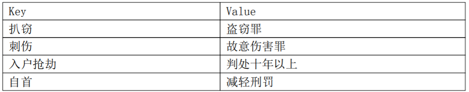

# AI-law

It's for a research for AI and law

### github项目

1. https://github.com/liuhuanyong/LawCrimeMining
Law Crime Mining Based on Corpus build and content analysis by NLP methods. 基于领域语料库构建与NLP方法的裁判文书与犯罪案例文本挖掘项目

1. https://github.com/liuhuanyong/CrimeKgAssitant
Crime assistant including crime type prediction and crime consult service based on nlp methods and crime kg,罪名法务智能项目,内容包括856项罪名知识图谱, 基于280万罪名训练库的罪名预测,基于20W法务问答对的13类问题分类与法律资讯问答功能.

3. https://github.com/bamtercelboo/Awesome-Law-NLP-Research-Work
Awesome Law NLP Research Work, Paper, Competition, Project, Onlline System
一个大佬的git项目，记录了AI+Law相关的论文、产品、比赛等

4. https://github.com/thunlp/LegalPapers
大佬列出的法律必读论文

### 竞赛

COLIEE Winner Papers(Competition on Legal Information Extraction and Entailment )

1.任务说明

1.1（COLIEE案例法竞赛）任务1：法律案例检索任务
这场法律案件竞赛的重点是法律信息处理的两个方面，这些方面与主要由Compass Law提供的加拿大联邦法院判例法数据库有关。

法律案件检索任务包括读取新案件Q，并从整个案件法语料库中提取支持案件S1，S2，... Sn来确定Q。通过该文件，我们将判定新案件的支持案件称为“已注意到的案件”。

1.2（COLIEE案例法竞赛）任务2：法律案例确定任务
这项任务涉及从现有案例中识别一个段落，该段落需要决定一个新案例。

给定新案例的决策Q和相关案例R，需要确定包含决策Q的特定段落。我们确认，仅通过一些示例的信息检索技术就无法识别答案段落。由于案例R与Q相关，因此R中的许多段落都可以与Q相关，而无需考虑。

此任务需要一个人确定一个需要Q决定的段落，因此需要一种特定的包含方法来比较此任务中R和Q中每个段落的含义。

1.3（COLIEE法规法竞赛）任务3：法规法检索任务
COLIEE法规法律竞赛的重点是与回答日本法律律师考试中的是/否问题有关的法律信息处理的两个方面（相关数据集已从日语翻译为英语）。

法律问题解答任务的任务3涉及阅读法律律师考试问题Q，并从整个民法典中提取日本民法典条款S1，S2，...，Sn的子集，这些子集适用于回答该问题，从而

需要（S1，S2，...，Sn，Q）或需要（S1，S2，...，Sn，不是Q）。

给定问题Q和整个民法典条款，我们必须检索“ S1，S2，...，Sn”的集合作为此轨道的答案。

1.4（COLIEE法规法竞赛）任务4：法律问答数据集
法律问题解答任务的任务4涉及标识包含关系，例如

Entails（S1，S2，...，Sn，Q）或Entails（S1，S2，...，Sn，不是Q）。

给定一个问题Q，我们必须在第一阶段检索相关的文章S1，S2，...，Sn，然后我们必须确定相关的文章是否包含“ Q”或“不是Q”。该曲目的答案是二进制的：“是”（“ Q”）或“否”（“非Q”）。

1. Statute Law Information Retrieval and Entailment
2. Combining Similarity and Transformer Methods for Case Law Entailment
3. Building Legal Case Retrieval Systems with Lexical Matching and Summarization using A Pre-Trained Phrase Scoring Model

[CAIL 2018](https://github.com/thunlp/CAIL)

任务一（罪名预测）：根据刑事法律文书中的案情描述和事实部分，预测被告人被判的罪名；

任务二（法条推荐）：根据刑事法律文书中的案情描述和事实部分，预测本案涉及的相关法条；

任务三（刑期预测）：根据刑事法律文书中的案情描述和事实部分，预测被告人的刑期长短

[CAIL 2019](https://github.com/thunlp/CAIL)

任务一（阅读理解）：裁判文书中包含了丰富的案件信息，比如时间、地点、人物关系等等，通过机器智能化地阅读理解裁判文书，可以更快速、便捷地辅助法官、律师以及普通大众获取所需信息。本任务是首次基于中文裁判文书的阅读理解比赛，属于篇章片段抽取型阅读理解比赛（Span-Extraction Machine Reading Comprehension）。为了增加问题的多样性，参考英文阅读理解比赛SQuAD和CoQA，本比赛增加了拒答以及是否类（YES/NO）问题。

任务二（要素识别）：本任务的主要目的是为了将案件描述中重要事实描述自动抽取出来，并根据领域专家设计的案情要素体系进行分类。案情要素抽取的结果可以用于案情摘要、可解释性的类案推送以及相关知识推荐等司法领域的实际业务需求中。具体地，给定司法文书中的相关段落，系统需针对文书中每个句子进行判断，识别其中的关键案情要素。本任务共涉及三个领域，包括婚姻家庭、劳动争议、借款合同等领域。

任务三（相似案例匹配）：本任务是针对多篇法律文书进行相似度的计算和判断。具体来说，对于每份文书我们提供文书的标题和事实描述，选手需要从两篇候选集文书中找到与询问文书更为相似的一篇文书。为了减小选手的工作量，我们相似案例匹配的数据只涉及民间借贷、知识产权纠纷和海商海事这三类文书。

### 论文

1. Semi-Supervised Methods for Explainable Legal Prediction (ICAIL2019)
   * 16,024 World Intellectual Property Organization (WIPO) domain name dispute cases
   * the decision is “transferred” or “not transferred.”
   * 这篇文章分析了目标案件的特征，制定了schema用The MITRE Annotation Toolkit自动标记。
2. Why Machine Learning May Lead to Unfairness: Evidence from Risk Assessment for Juvenile Justice in Catalonia (ICAIL2019)
   * 观察了4753名加泰罗尼亚青少年，他们在2002年至2010年期间犯罪，其累犯行为于2013年和2015年记录。SAVRY评估仅适用于855名被告。
   * SAVRY(the Structured Assess- ment of Violence Risk in Youth)，少年司法专业人员将严重性（低，中，高）的三级编码结构得分分配给24种危险因素和6种保护因素
   * logit mlp knn lsvm rsvm nb rf
   * 它表明，使用年龄，性别，国家/地区等特征来预测犯罪累犯会导致不公平。

3. The False, the Former, and the Parish Priest (ICAIL2019)
Robert

   * 本文提出了Calculemus方法，去构建一个形式化的框架Formal Language for the INTerpretation of sources of norms (FLINT). The frames are act frames, duty frames, and fact frames.并针对Catholic Marriage案例进行了研究。（FLINTJ今年年末发表）

4. Interpretable Charge Predictions for Criminal Cases:
Learning to Generate Court Views from Fact Descriptions (NAACL2018)

   * a new task for natural language generation (NLG) problem
   * [github](https://github.com/oceanypt/Court-View-Gen)只有数据

5. Event Identification as a Decision Process with Non-linear Representation of Text (NAACL)

   * 本文通过学习整片文章，区分出有事件的句子。模型将词、句子、自然段一起进行记忆，加上控制器，在状态更新时生成标签。

6. Legal Judgment Prediction via Topological Learning (EMNLP2018)
   * 本文构建对（事实描述、法条、罪名、刑期）等子任务构建DAG图，提出了TOPJUDGE的框架，分析出（罪名依赖法条，刑期依赖法条和罪名）的依赖关系。
   * 数据：CJO,PKU,CAIL
   * [github](https://github.com/thunlp/TopJudge)

7. Charge-Based Prison Term Prediction with Deep Gating Network (	EMNLP2019 )[PDF](https://arxiv.org/pdf/1908.11521.pdf)
   * 本文提出了根据罪名预测刑期，因为现实中有很多案例里有多个罪名，而现有的一些模型都是预测总的刑期，所以根据不同的罪名预测刑期会比较现实一些。
   * 本文公开了一个[数据集]( https://github.com/huajiechen/CPTP )
   * 本文提出了一个模型：Deep Gating Network

8. Legal Judgment Prediction via Multi-Perspective Bi-Feedback Network (IJCAI2019) [PDF](https://arxiv.org/pdf/1905.03969.pdf)
   * 本文将刑事预测的3个子任务法条预测、罪名预测、刑期预测进行分析，组织topology关系，并对输出进行多种方式结合，并且加上数字的Attention机制。

### 数据集

ECHR Dataset - ACL 2019

Neural Legal Judgment Prediction in English[PDF](https://arxiv.org/pdf/1906.02059.pdf)

CAIL2018: A Large-Scale Legal Dataset for Judgment Prediction[PDF](https://arxiv.org/pdf/1807.02478.pdf)

Large-Scale Multi-Label Text Classification on EU Legislation.[PDF](https://arxiv.org/pdf/1906.02192.pdf)

A Test Collection for Evaluating Legal Case Law Search.[PDF](https://dl.acm.org/citation.cfm?id=3210161)

### 软件产品

1. http://data.court.gov.cn/pages/litigation.html
中国司法大数据研究院：智能诉讼评估，根据问题，起诉状，或描述生成评估报告。

2. 法律小崇（微信小程序）
   
3. 法狗狗（微信小程序）
   
4. 法立方AI（微信小程序）
   
5. 法信(智答版), 人民法院出版集团、中国司法大数据研究院和北京国双科技有限公司， ---> [法信(智答版)]

6. 觅律搜索, 北京幂律智能科技有限责任公司， ---> [觅律so.legal]

7. 度小法---法律智库, 百度， ---> [度小法]

8. 北大法宝, 北京北大英华科技有限公司、北京大学法制信息中心， ---> [北大法宝]

9.  法律智能判决系统, 黑龙江大学自然语言处理实验室， ---> [法律智能判决系统]

10. 法小飞, 哈工大讯飞联合实验室， ---> [法小飞-微信公众号]

11. 秘塔翻译及智能检索, 秘塔科技， ---> [秘塔翻译及智能检索]

12. 包小黑法律咨询, 杭州实在智能科技有限公司， ---> [包小黑法律咨询]

### 专利

1. https://patentimages.storage.googleapis.com/9f/c6/fb/ced1e1e894be69/CN107122444A.pdf
中华人民共和国知识产权局 2017.09.01：一种法律知识图谱构建的方法。

   * 主题词-主题关系-主题词
   * 主题词-相近关系-相近词

2. 一种基于图的裁判文书案件相似计算与检索方法及系统，公开号：CN108038091A

   * 1、采集裁判文书；2、识别裁判文书的说理部分；3、解析说理部分的案件要素；4、**生成案件事理图谱；** 5、客户端接收检索信息；6、抽取或映射案件要素；7、**匹配计算案件要素事理图谱；** 8、返回与检索内容相似的案件。

3. 一种相似案件检索方法及装置，公开号：CN106126695A

   * S1：组织裁判文书；S2：**构造案件特征树；** S3：训练案件特征权重树；S4：输入检索信息；S5：计算案件相似矩阵；S6：展示检索结果。
   * 采用决策树方法，针对不同目标多次训练计算综合权重，且树中父节点权重为子节点权重和

4. 自动判案方法及系统，科大讯飞，公开号：CN 108133436 A

   * 获取待判案件相关资料；对所述待判
案件相关资料进行分词及向量化处理，得到待判
案件的文本向量；对预先构建的先验知识库中的
信息进行向量化处理，得到先验知识向量；将所
述先验知识向量及所述待判案件的文本向量输
入预先构建的判案模型，根据所述判案模型的输
出得到判案结果。
   * 先验知识

5. 刑事案件智能证据校验方法、审查方法及具
有其的存储介质和终端设备,上海市高级人民法院; 科大讯飞，公开号：107358550A

6. 一种文本校验方法、装置、设备及可读存储介质,科大讯飞，公开号：108764194A

   * 司法案件审核等，进一步根据待校验文本信息，确定所需校验要素的要素值，该校验要素与活动项目相对应，最终根据所述校验要素的要素值，确定所述待校验文本信息是否合规。

7. 一种裁判量刑偏离度预测方法及装置,科大讯飞，公开号：110287292A

   * 获取目标卷宗材料；从所述目标卷宗材料中提取各个目标案情要素；根据量刑关联信息，预测所述目标卷宗材料对应的判决结果的偏离度，所述量刑关联信息包括各个目标案情要素与各个样本案情要素之间的关联关系，所述各个样本案情要素是从大量样本卷宗材料中提取的。

8. 法律回答生成方法及装置,科大讯飞，公开号：CN 110008327 A

   * 强化学习

9. 一种证据指引方法、装置、设备及存储介质,科大讯飞，公开号：CN110175333 A

   * 获取目标文本中与案情相关的问答部分；根据问答部分获取与案情相关的目标事件信息；根据目标事件信息确定需要收集的证据。

10. 基于栅栏式长短时记忆神经网络的关键词抽取方法及系统，清华大学，公开号：CN 110263323 A

    * 将待抽取关键词的法律文本语料输入到基于栅栏式长短时记忆神经网络的文本编码模型中，获得文本语义特征向量序列；将所述文本语义特征向量序列输入至关键词识别模型中，获得关键词抽取结果；其中，所述文本语义特征向量序列包含了所述待抽取关键词的法律文本语料中的字语义信息、词语义信息和上下文信息；其中，所述文本编码模型和所述关键词识别模型是根据带有关键词标注的法律文本语料样本进行联合训练后获得的。