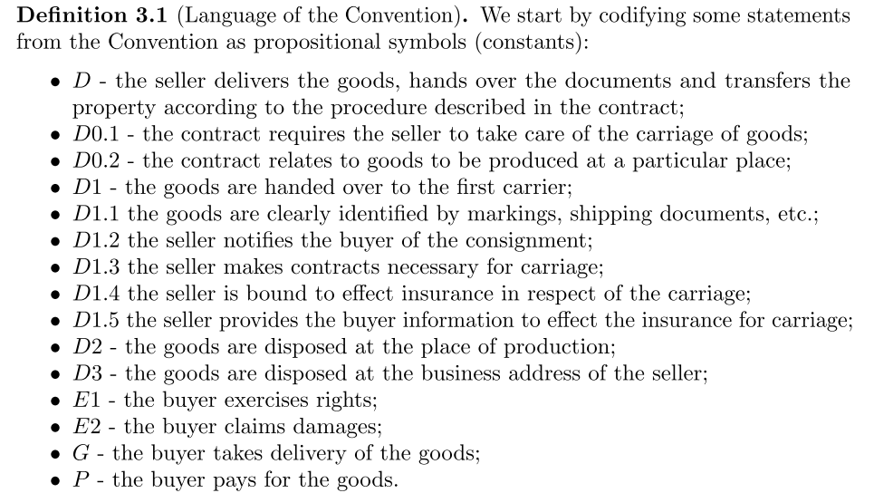
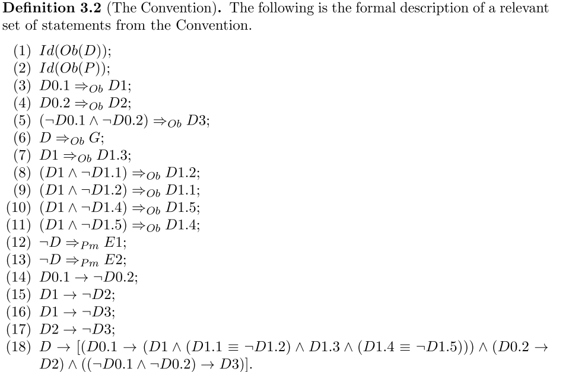
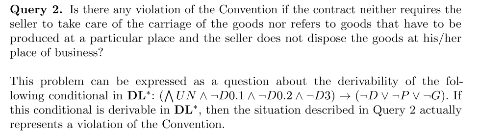
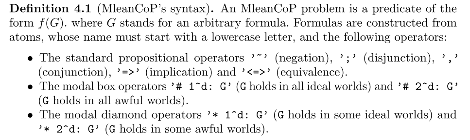
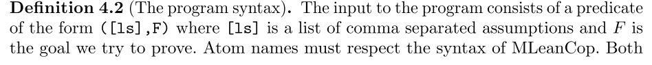
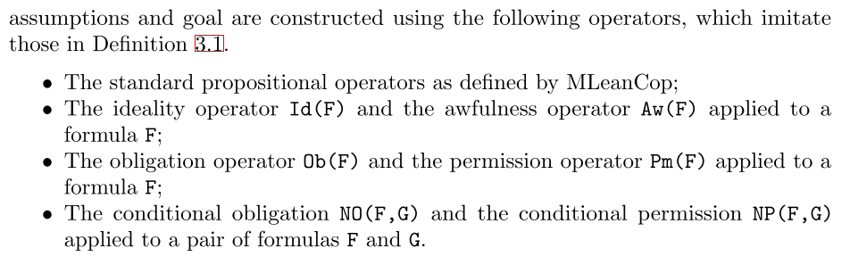
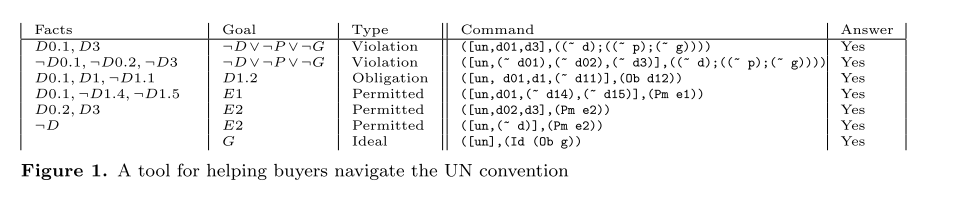
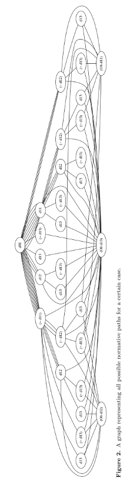

# [具有理想条件的规范分离结构中的自动推理](ICAIL/2019/Long/1810.09993.pdf)

本文构建了一种基于道义逻辑的自动推理方法。

DL 道义逻辑， DL*道义逻辑的一个变种，本文利用DL\*在具有以下特征的结构里推理：一列理想规范陈述，规范条件清单，各种陈述之间的事实清单和一些事实情况。

该结构叫作 理想条件下的标准拆离结构。

具体方法如下：

1. 分析法条
2. 根据法条定义命题符号：
3. 用命题符号表示法条：

然后根据问题生成对应的条件：如

用 MleanCop (a proof-calculus) 来自动回答问题

MleanCop 的语法：

问题的语法：

应用结果：

法官可以给该系统一套已知事实和一套未知参数，还有一些可能感兴趣的结果。就可以把这些信息展现成一张相关法律图。用这张图法官就可以轻松看到所有可能的结果，可以避免作出不符合事实的决定。

第二个应用是 可以只输入，程序给出结果并构造出相关图。如：

