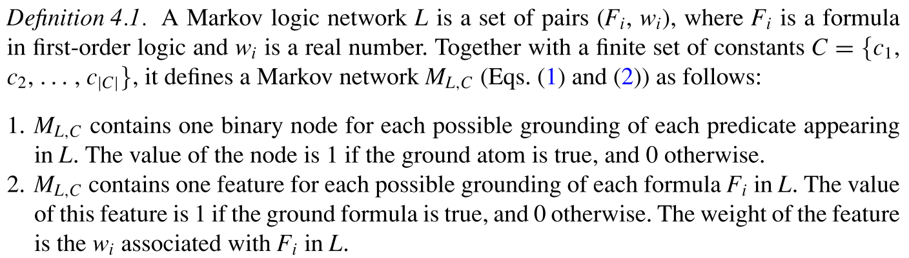

# Markov Logic Networks

马尔科夫逻辑网：本文提出了将一阶逻辑和概率网模型的结合的方法，并开发了推理和学习MLN的高效算法。

马尔科夫逻辑网将一阶逻辑公式附属上权重，可以看成一种马尔科夫网的模板。从概率的角度可以说，马尔科夫逻辑网提供了一个紧凑的语言去生成一个大的马尔科夫网，并将领域知识以灵活化，模块化的方式嵌入进去。

## 马尔科夫逻辑网定义

ground Markov network : 给定不同的常量集合，会生成不同的网络，一个生成的网络叫作ground Markov network.

一个 ground Markov network 中求 x 的概率有以下公式：

$$
P(X=x) = \frac{1}{Z}(\sum _i w_i n_i (x) ) = \frac{1}{Z} \prod _i \phi _i (x _{\{i\}}) ^{n _i (x)}
$$

每个 $M _{L, C}$ 的状态表示一个可能域， 一个可能域是一个物体的集合，一个函数的集合，一个关系的集合；它们之间的相互作用决定了每一个子元素的真值。

下面的假设保证了 $(L, C)$是有限的，并且 $M _{L, C}$ 对这些可能域都表示一个独特的，定义良好的概率分布。

本文证明了：

命题： 离散或有限精度数值变量上的每个概率分布都可以表示为马尔科夫逻辑网络。

命题： 令$KB$为可满足的知识库，$L$ 为通过将权重$w$ 分配给$KB$ 中的每个公式而获得的MLN， $C$为$KB$中出现的常数的集合，$P_w(x)$ 为MLN分配给一个或多个可能x的概率，$\mathcal{X} _{KB}$ 为满足$KB$的域集合， $F$ 为任意一个一阶逻辑的公式。则：

1. $$ 
   \forall x \in \mathcal{X} _{KB} \quad lim _{w \to \infin} P_w (x) = |\mathcal{x} _{KB}| ^{-1} 
   $$
   $$ 
   \forall x \notin \mathcal{X} _{KB} \quad lim _{w \to \infin} P_w (x) = 0
   $$ 
2. $$ 
   For \, all \, F, KB \models F \quad iff \quad lim _{w \to \infin} P_w (F) = 1.
   $$

马尔科夫网会非常大，不过通过加类型的常量和变量，并且只具体化(grounding) 同一类型的变量为常量，可以减小马尔科夫网的大小。不过这样还是很大，幸运的是推理不需要用到整个网络，请看：

## 推理

马尔科夫逻辑网可以回答具有如下形式的任意问题：“给定公式$F_2$,公式$F_1$会有什么样的概率？”

$$
\begin{aligned}
    P(F_1 | F_2, L, C) & = P(F_1 | F_2, M_{L, C}) & \\
                    &    = \frac{P(F_1 \land F_2 | M_{L,C})}{P (F_2 | M_{L, C})}& \\
                    & = \frac{\sum _{x \in \mathcal{X}_{F_1} \cap \mathcal{X}_{F_2}} P(X=x|M_{L,C})}{\sum _{x \in  \mathcal{X}_{F_2}} P(X=x|M_{L,C})}
\end{aligned}
$$

上述公式 正在大多数情况下是 棘手的(intractable) 除了很小的领域。因此MLN推理包含概率推理，是 #P-complete的，并且逻辑推理甚至在有限领域是NP-complete。

原则上，可以用MCMC算法求解，可是太慢了。本文提出了一个算法，应用于当 $F_1$和 $F_2$ 是字的合取时。虽不通用，但实践中是最频繁使用的。

本算法分两个阶段：

第一阶段：找到求解 $P(F_1 | F_2, L, C)$需要的最小的子集 $M$ .

第二阶段：在该网络上推理。如Gibbs采样。Gibbs采样基本步骤是：给定一个原子的马尔科夫毯采样一个原子。马尔科夫毯是和它一起出现在同一公式的一组原子。

算法如下：

则一个原子在其马尔科夫毯$B_l$在其状态$b_l$的概率为

$$
P(X_l=x_l | B_l=b_l) = \frac{exp(\sum_{f_i \in F_i} w_i F_i (X_l = x_l, B_l = b_l))}{exp(\sum_{f_i \in F_i} w_i F_i (X_l = 0, B_l = b_l))+exp(\sum_{f_i \in F_i} w_i F_i (X_l = 1, B_l = b_l))}
$$

$F_l$是公式，$f_i(X_l=x_l,B_l=b_l)$是（0或1）。

预测一个合取范式的概率就是先采样为真的字，直到马尔科夫链收敛。

当MLN是因果关系的形式时，可以用MaxWalkSat来找到满足hard条件的部分,一个局部搜索权重满足问题的算法。然后在用Gibbs抽样，取得概率。

## 学习

从一个或多个关系数据库中学习权重。

当一个原子不在数据库，它被认为是false.

一个数据库可看成一个向量$x=(x_1,...,x_l,...,x_n)$ , $x_l = 1$ 如果出现在数据库中，否则 $x_l = 0$

对1式求导可以求得权重：

$$
\frac{\delta}{\delta w_i}log P_w (W=w) = n_i (x) - \sum _{x'} P_w (X = x') n_i (x')
$$

计算上式，需要计算公式中为真的数量，这是棘手的(intractable).

命题：数一个数据库中一阶因果的真值数是#P-complete的。

伪概率：

$$
P ^* _w (X=x) = \prod ^n _{l=1} P_w (X_l = x_l | MB_x (X_l))
$$

$MB_x(X_l)$ 是 $X_l$的马尔科夫毯

该公式在许多方面都较快，并且为防止过拟合，用Gaussian prior来惩罚。

Inductive logic programming(ILP) 也可以用来学习。

## 实验