# 法律智能应用体验报告

## 法狗狗（微信小程序）

法狗狗有3个法律AI+的模块：智能咨询、刑期预测、智能调解。

### 智能咨询

智能咨询的全部分类有：婚姻家事，员工纠纷，交通事故，企业人事，民间借贷，公司财务，房产纠纷，知识产权，刑事犯罪，消费维权。

智能咨询有大量的法律专业问题供用户选择或提问一些新的问题。

如婚姻家事：

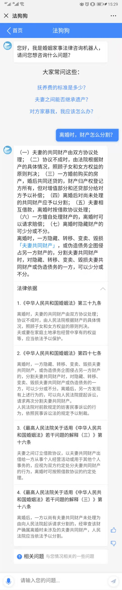

如员工纠纷：

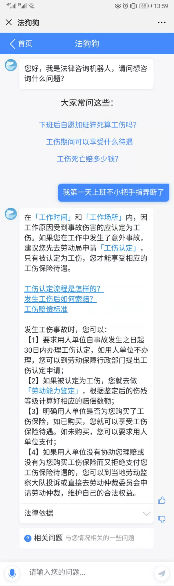

如房产纠纷：

名词解释小标签：

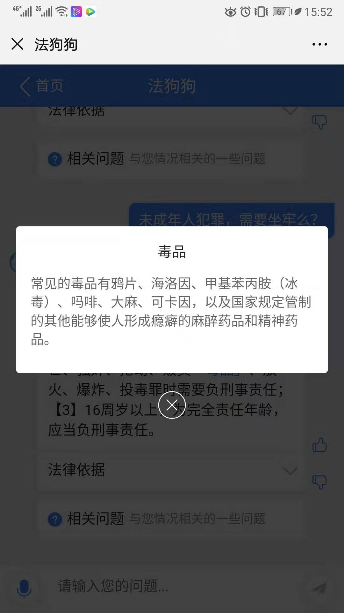

智能咨询概评：首先，在每个分类里随机点了两三个问题，整体来说问题的质量还是比较高的，并且提供了相关问题的连接，可以继续看相关问题的答案。其次，问题的答案还可以，大多是几百字的长篇幅，不过还是论点分明的，也有更长的，它会缩成一个小标签，点击后进入一个新的页面，大部分答案都是配有相关法条的。有的答案里还会给出相应的问题如员工纠纷的例子，非常不错的设计。还有更好的一点是答案里有些专业名词给出了连接，是一个名词解释小标签。最后，在一个领域问另外领域的问题，机器人也是可以知晓的，如房产纠纷的例子。

### 刑期预测

刑期预测的主页：

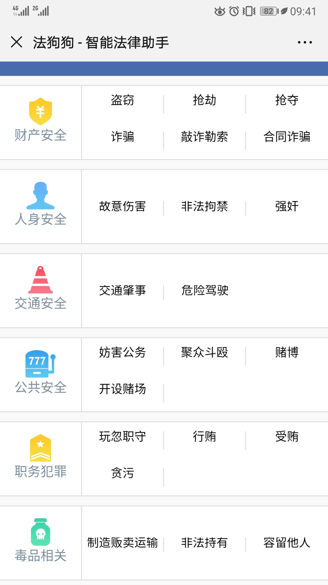

罪名事项的填写：

所在地区的选择：

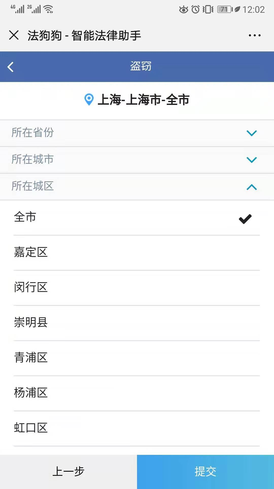

罪名预测的报表：

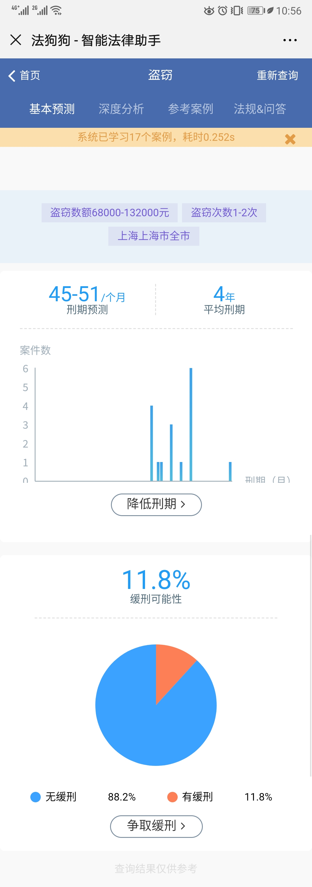

争取缓刑的事项：

争取缓刑的事项详情：

降低刑期的事项：

罪名预测的深度分析：

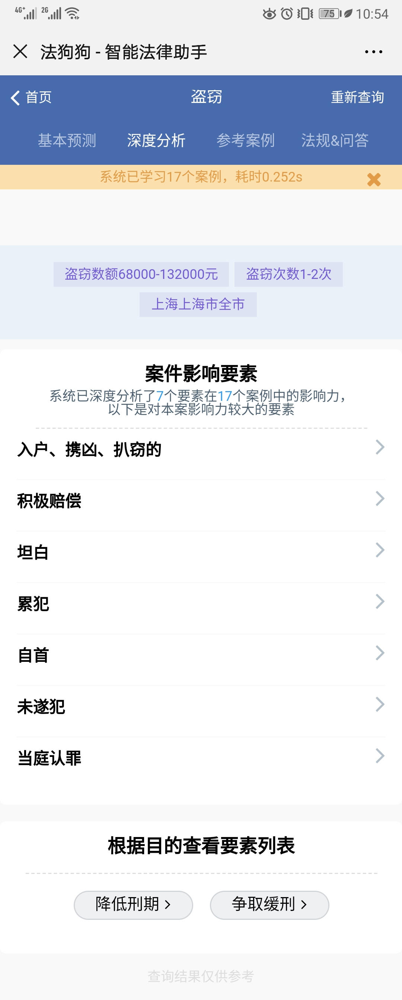

深度分析里对案件有影响的要素的分析报表：

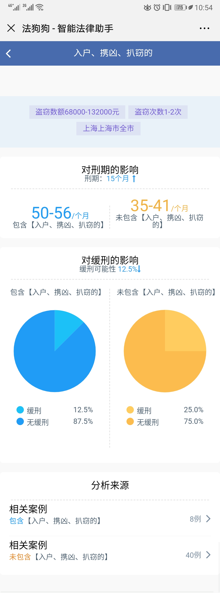

深度分析里对案件有影响的要素的案例：

罪名预测的参考案例：

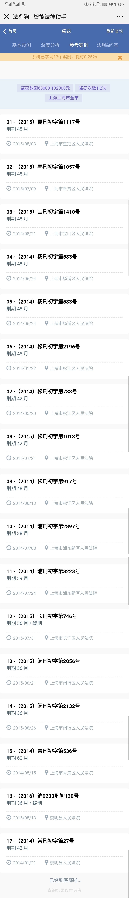

罪名预测的案例详情页：

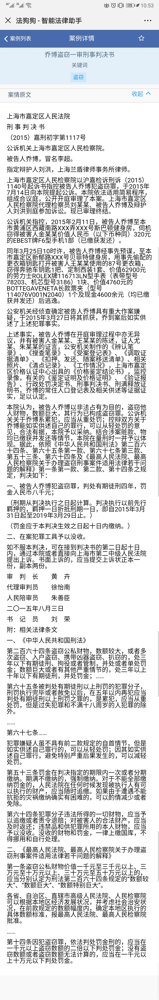

罪名预测的法规&问答：

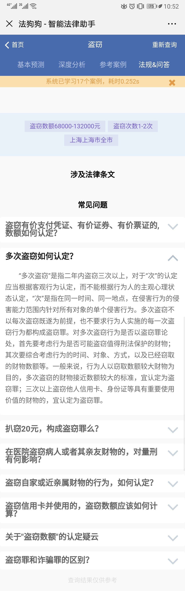

刑期预测概评：首先，它对刑法的刑法里常见的一些罪名做了分类，每一个分类里，又分成具体的罪名。然后，点入罪名页后，它会让你选择一些金额或人数或次数等一两个或两三个和罪名相关的事项，填完后，还会让你选择你所在的地区，之后就会生成罪行预测的报表。报表看起来还很炫酷，其实，最好的功能在深度分析里，深度分析会列出和案件相关的事件要素，点进一个事件要素，有事件要素分析页，又出现了一个很炫酷的报表，报表很清晰地反映了该要素对刑期的影响，对缓刑的影响。页面的下方还有和该影响要素的相关案例，包括包含该要素的和不包含该要素的案例。最后，就是罪名预测里的参考案例和法规&问答页了，参考案例里有判决文书和相关的法律条文；法规&问答里有涉及的法律条文和常见的问题，给出的问题不多但都是相关的，答案也不错。

### 智能调解

智能调解主页

概评： 智能调解是一个线上调解平台，申请注册后可以线上寻找调解机构，申请调解员调解。

## 法律小崇（微信小程序）

### 法律小崇的主页：

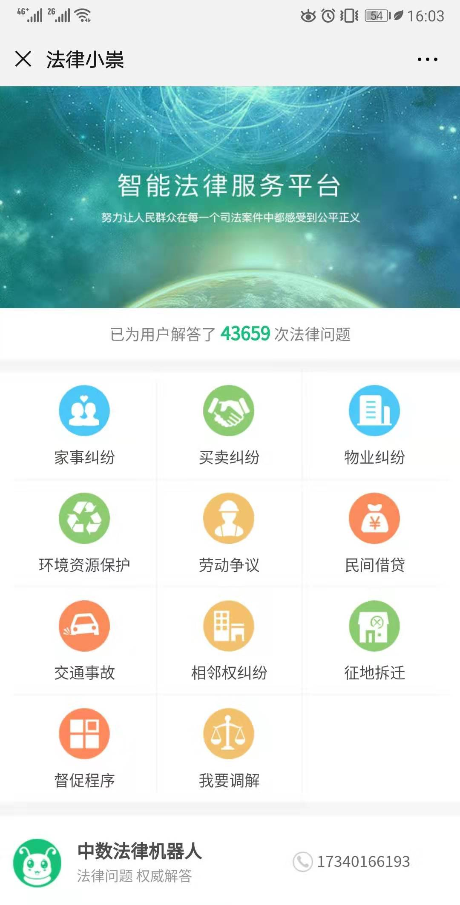

法律小崇主要解决民法领域里的问题。解决问题的方式是不断地向用户提问题：

### 如家事纠纷里的一个例子：

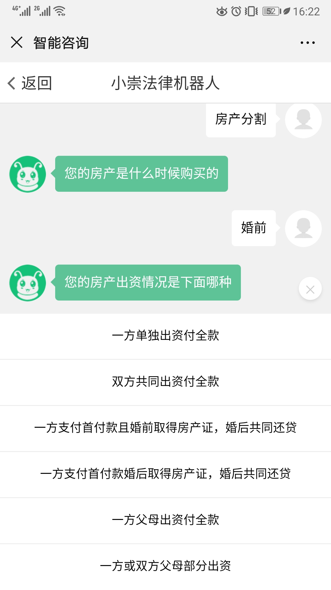

最后的案件推送即分解显示无：(再补一张其他的)

还有一个我要调解的智能调解机器人：当我依次按要求填完信息后，显示该地区没有符合要求的调解院员。

概评：法律小崇智能咨询的提问总体来说还是很有逻辑性的。

## 法立方AI（微信小程序）

### 法立方AI 有魔法先知小程序：

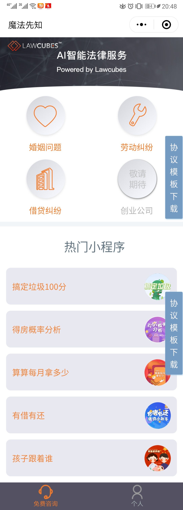

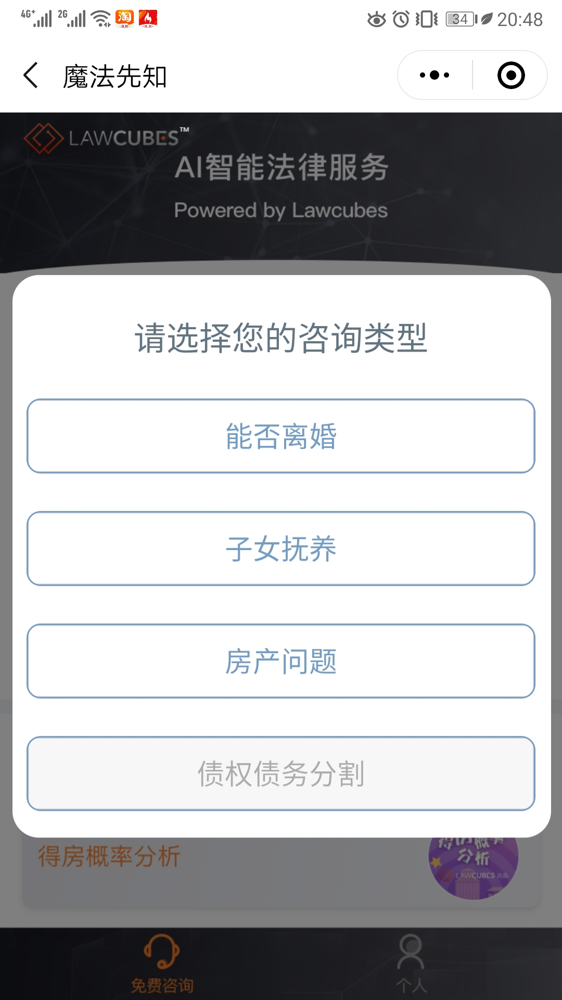

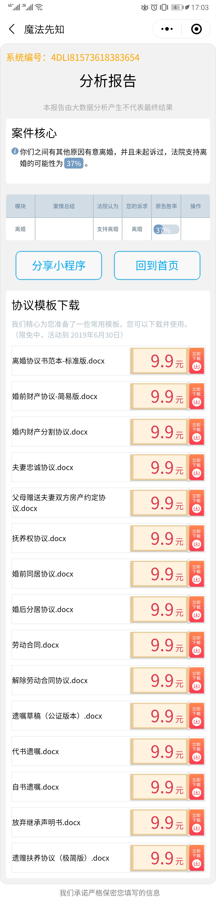

概评：总体来说它把具体的民事问题给了很细化的问答过程，足足有20个问题，最后的结果是通过大数据得出的，看起来还不错。但是当我再次想回答问题是已经进步去了，看来程序的可靠性还是有待提高的。

## 法信(智答版), 人民法院出版集团、中国司法大数据研究院和北京国双科技有限公司， ---> [法信(智答版)](http://www.lawiask.com/#/)

### 智能问答：

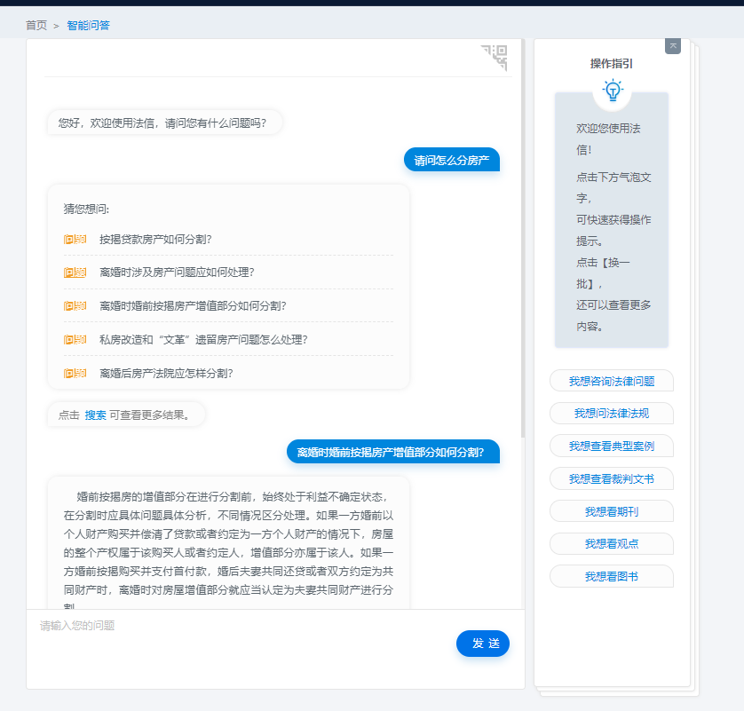

概评：用户给出一个问题，它给出相关问题，最后给出该问题的一大段答案，答案还不错吧，毕竟它给出了权威来源了。

### 一站式检索：

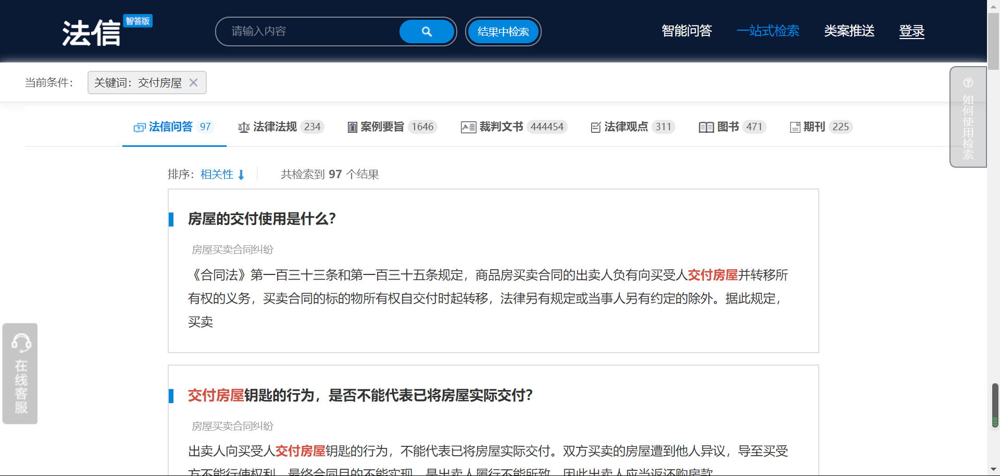

概评：信息真的很全。

### 类案推送：

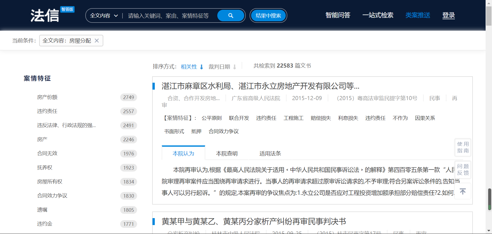

概评：包含了案件特征，很不错。

## 觅律搜索, 北京幂律智能科技有限责任公司， ---> [觅律so.legal](https://solegal.cn/)

### 觅律首页：

概评：觅律网是一个纯搜索案件、法规、律师、律所的网站，信息比较全。可以在搜索栏里直接搜问题，给出的下拉栏里有相关问题，会给出相关案例。案例分权威案例和普通案例，非常不错，案件数也很多。

## 度小法---法律智库, 百度， ---> [度小法](https://duxiaofa.baidu.com/)

### 法小度主页： 

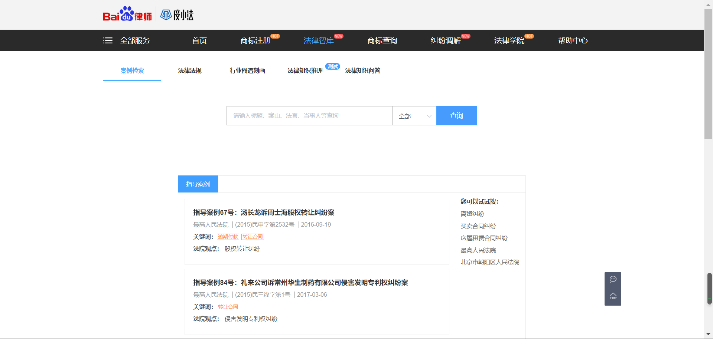

法小度包含： 案例检索、法律法规、行业图谱刻画、法律知识推理、法律知识问答

### 行业图谱刻画： 

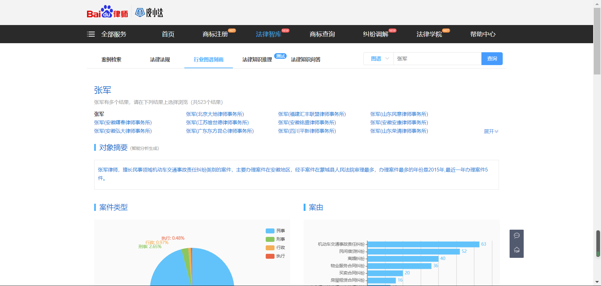

行业图谱刻画概评： 行业图谱刻画就是将法官、律师、律师等的信息用图表的方式呈现出来。图表的内容有案件类型、案由、地域、审理法院、裁判年份、审理程序、文书性质等。

### 法律知识推理：

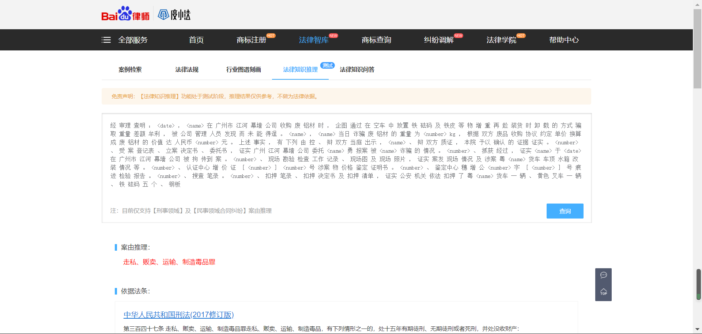

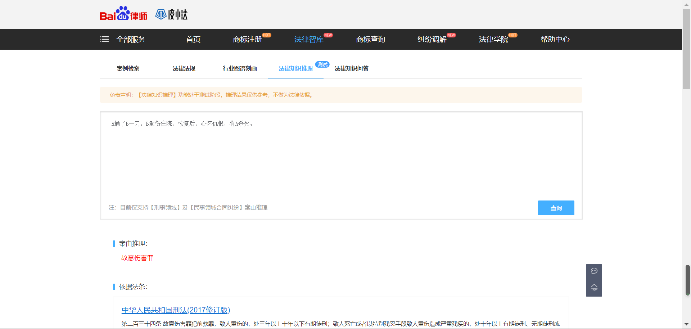

法律知识推理概评： 该功能显示是在测试阶段，只能推理刑事案件和民事领域合同案件，如上图，填写了两个案例，推理出罪名，然后给出相关案例。

### 法律知识问答： 

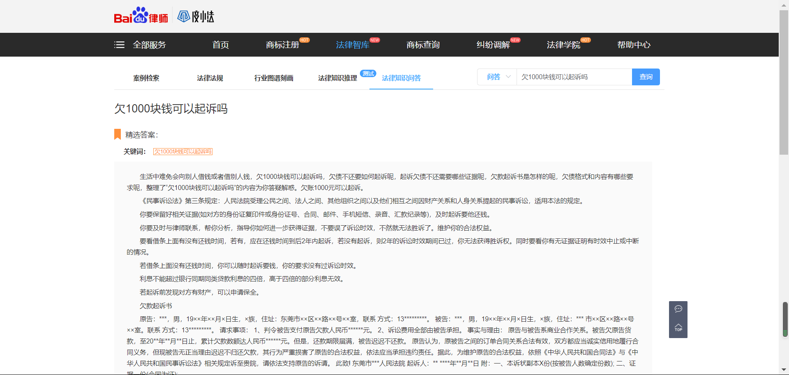

法律知识问答概评: 本人输入‘我室友欠我1000块该怎么办’，没有找到问题，但是它列出了一些相关问题，如：欠1000块可以起诉吗？相关度还行，问题的答案来源是从找法网、法律快车等网站，相对可靠。

## 北大法宝, 北京北大英华科技有限公司、北京大学法制信息中心， ---> [北大法宝](http://www.pkulaw.cn/)

北大法宝概评： 北大法宝是一个大型法律数据库，各大高校应该都有购买使用。当然，它也有很强大的AI[法小宝](http://ai.pkulaw.com/page/zhinengfalv.html)，毕竟它的数据很多。

### [法小宝](http://ai.pkulaw.com/page/zhinengfalv.html)：(PC端)

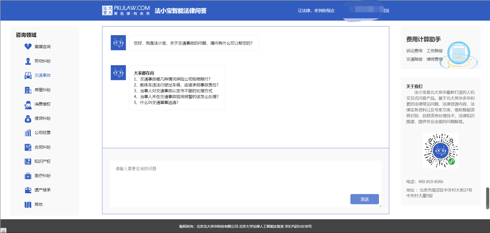

### 法小宝：（微信小程序）

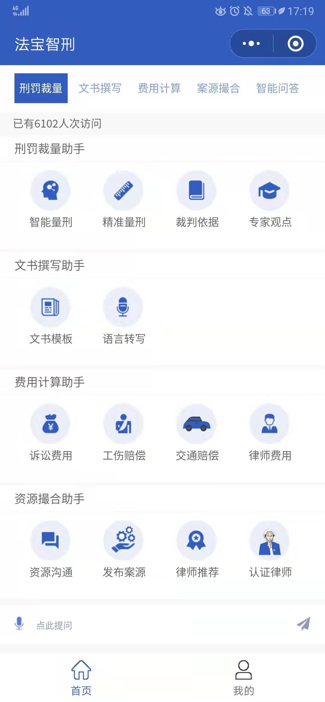

法小宝概评： 法小宝有强大的数据支撑，是一个完善的咨询平台，能够查询数个领域里的各种问题。得到的答案还算是准确的。 并且它还有**费用计算助手**十分务实，功能强大。

### [刑事法宝](http://xs.ai.pkulaw.cn/sentence/sentwo)

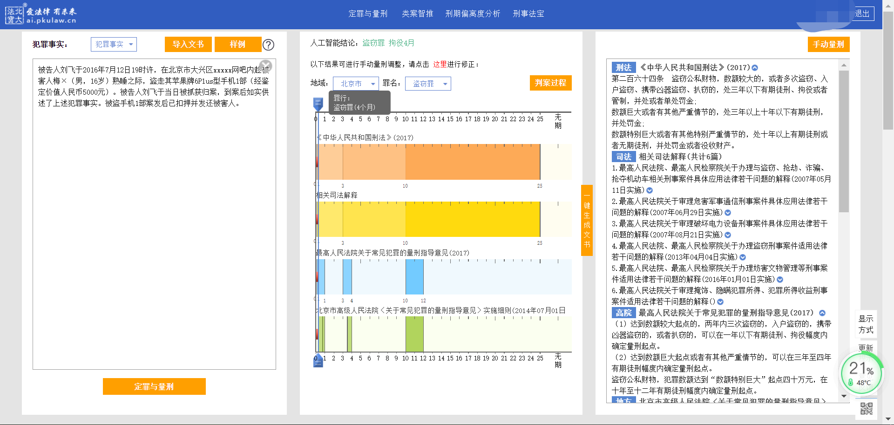

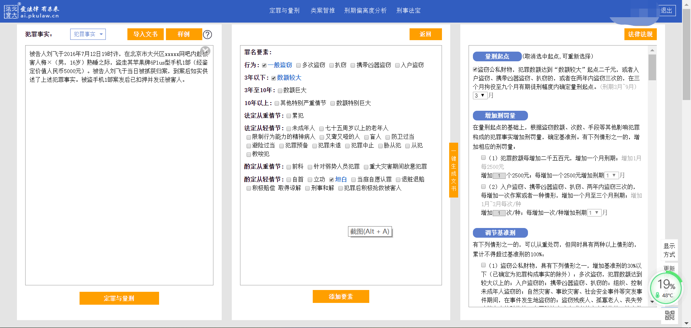

法小宝-刑事法宝概评： 法小宝的刑事是基于一段文字然后预测出罪名和刑期。旁边还有相关法条(相当具体)和案例。 其中， 判案过程里列举了一些要素出来，并将识别出的要素自动选上。

## 法律智能判决系统, 黑龙江大学自然语言处理实验室， ---> [法律智能判决系统](http://47.95.219.130/)

### 首页： 

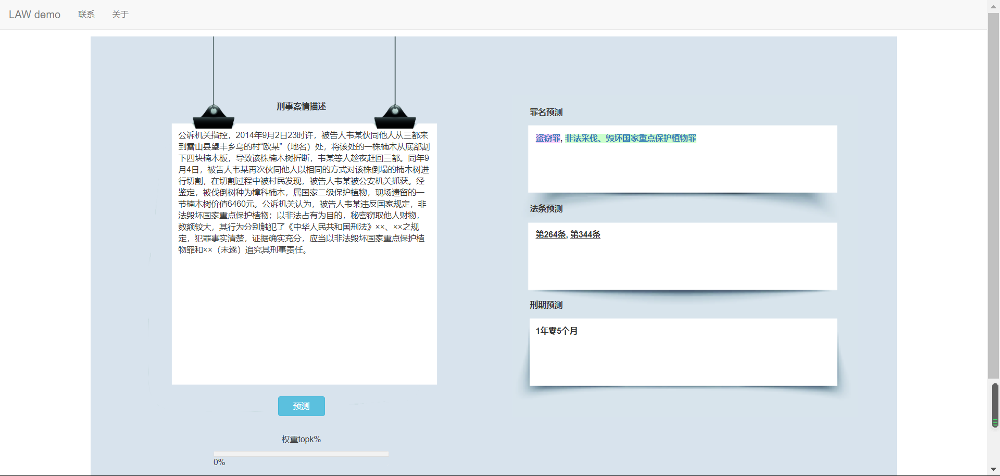

概评： 简陋的法律智能判决系统，有罪名预测，法律法规预测，刑期预测。

## 法小飞, 哈工大讯飞联合实验室， ---> [法小飞-微信公众号]

### 法小飞主页：

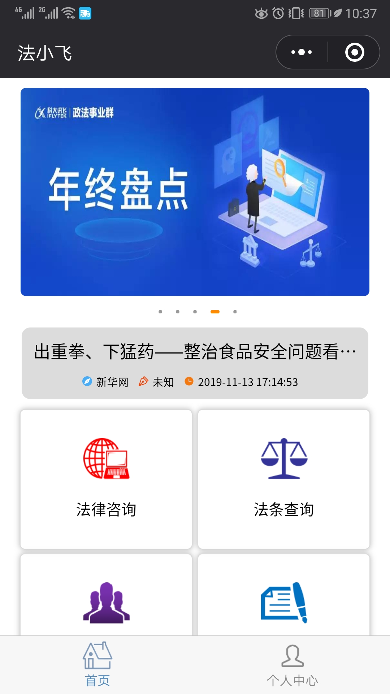

### 法律咨询： 

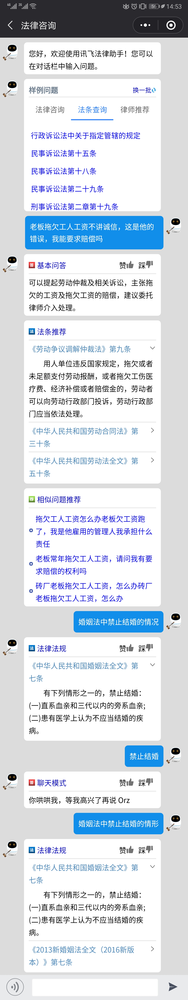

法律咨询概评： 包含法律咨询，法条咨询，律师推荐。法律咨询提供了很多问题，可以输入一个问题，它会给出一大段答案和相关的法律法规。同时它也可以单独查询法条，推荐律师。

### 案情分析： 

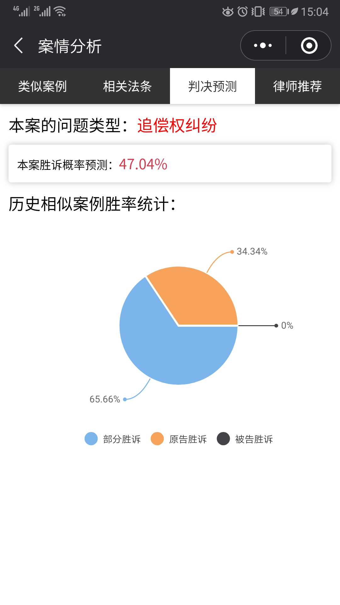

案情分析概评： 输入案件的一大段文本，给出案子的类似案例、相关法条、判决预测（胜诉的可能性）和律师推荐。

### 文本校对： 

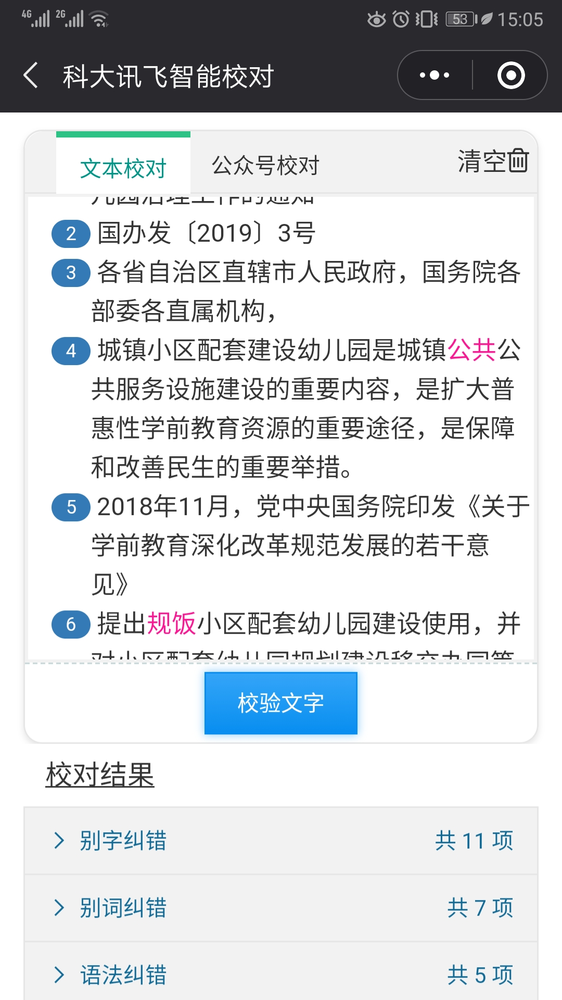

文本校对概评： 文本校对可以对案子文本的文字进行纠错。

### 案情问答： 

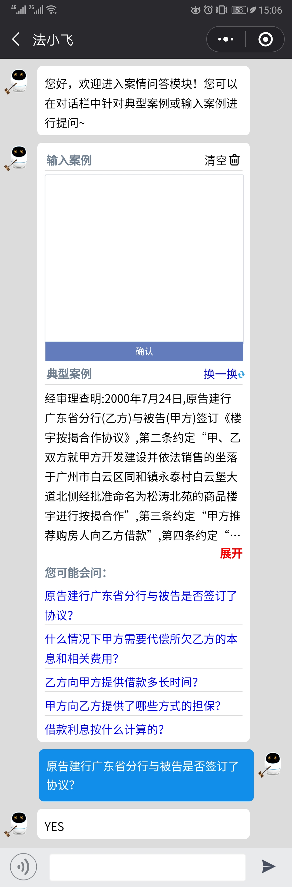

案情问答概评： 典型的阅读理解，可以回答一些和案子相关的问题。

## 秘塔翻译及智能检索, 秘塔科技， ---> [秘塔翻译及智能检索](https://metaso.cn/#/)

概评：这是一个专注法律文本AI翻译的网站。并且有检索功能，也有案源检索。

这里面有OCR。

## 包小黑法律咨询, 杭州实在智能科技有限公司， ---> [包小黑法律咨询](https://110.ai-indeed.com/)

### 包小黑主页： 

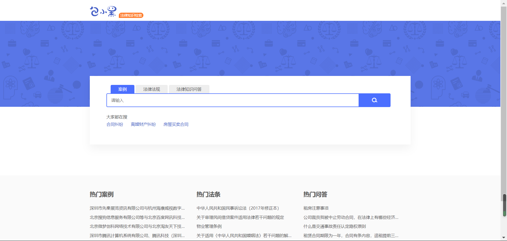

### 包小黑法律知识问答：  

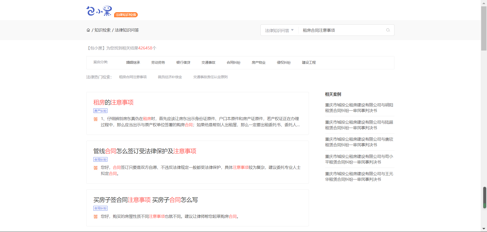

包小黑概评： 包含案例检索，法律法规检索和法律知识问答。其中，法律知识问答是输入一个问题，输出与问题相关的问题和答案。